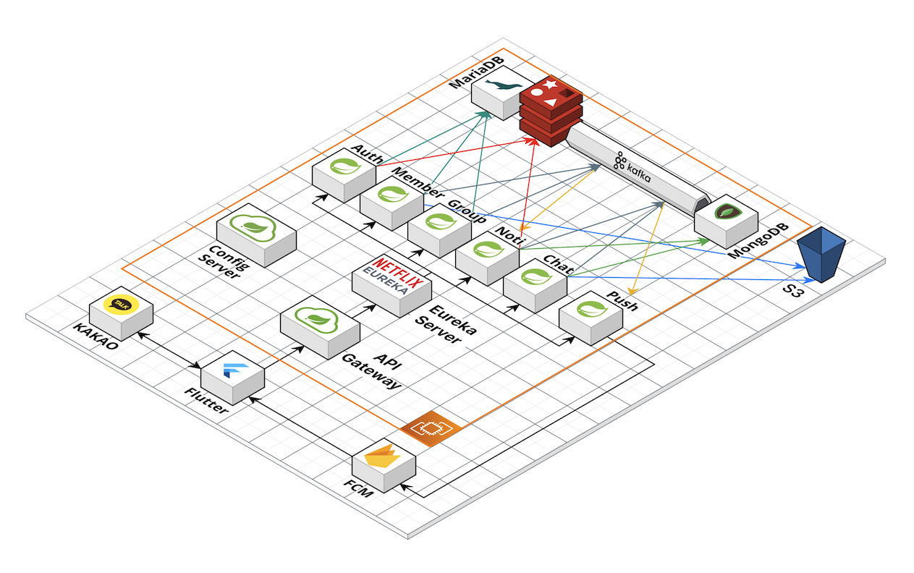

   다들 지금 모해? 우린 지금 Mohey!

 

   
   위치 기반 인스턴트한 모임 어플

<h3 align="center">MoHey</h3>

## 시연 영상

   <a href="https://youtu.be/58rwGny6IFA" target="_blank">
      </img>
   </a>

## Notion 기술 공유 
   <a href="https://inky-shop-0f9.notion.site/2f2d885b08ab4edbae204f5110e35988?pvs=4">
       노션 기술 공유입니다.
   </a>

## 💻 Service Summary

## 👩🏻‍💻 Developers

 
  <table>
     <tr align="center">
        <td>
           <B>허예림</B>
        </td>
      <td>
         <B>최주연</B>
       </td>
      <td>
         <B>김종혁</B>
       </td>
      <td>
        <B>임하은</B>
      </td>
      <td>
        <B>박현철</B>
      </td> 
      <td>
        <B>박수빈</B>
      </td>
     </tr>
     <tr align="center">
        <td>
           
            
           <a href="https://github.com/yerimstar">
              <I>yerimstar</I>
           </a>
           
팀장, UI/UX BE, MSA 

        </td>
         <td>
           
            
           <a href="https://github.com/CHOI-JOO-YEON">
              <I>JOO-YEON</I>
           </a>
            
FE, BE  MSA 

         </td>
         <td>
           
            
           <a href="https://github.com/ShineHyuk">
              <I>ShineHyuk</I>
           </a>
          
FE, BE  MSA 

        </td>
        <td>
           
            
           <a href="https://github.com/yxalaG">
              <I>yxalaG</I>
           </a>
          
UI/UX, BE  CI/CD 

        </td>
        <td>
           
            
           <a href="https://github.com/rulrurara">
              <I>rulrurara</I>
           </a>
          
FE, BE  CI/CD 

        </td>
        <td>
           
            
           <a href="https://github.com/Soobin-Park">
              <I>Soobin-Park</I>
           </a>
           
FE, BE  CI/CD 

        </td>
     </tr>
  </table>

## ⚙️ System Architecture

## 🔧 Skills

 
  <h3>BE</h3>
  
  
  
  
  
  
  
  
  <h3>FE</h3>
    
  
  <h3>DB</h3>
    
  
  
  <h3>Infra</h3>
  
  
  
  
  
  
    <h3>ETC</h3>
  
  
  
    

